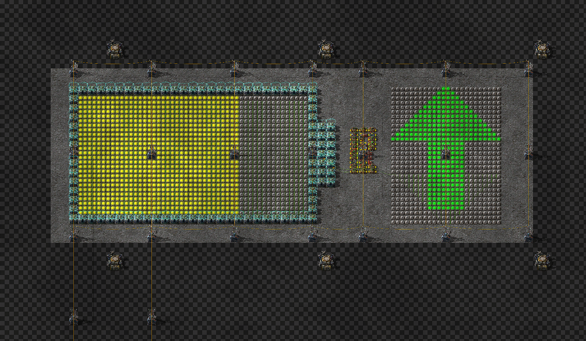

## Accumulator Level Display
Display the charge level of all your accumulators in a grid of lamps.  
The left display will show the charge level, including changing colors as the level changes.  
The right display will tell you the current trend of the charge (whether it is increasing, staying equal or decreasing).  
  

 

### Map view (requires mod [Lamps on Map](https://mods.factorio.com/mod/lampsonmap)):

  

### Blueprint string:
- [Accumulator Level Display](./accumulator_level_display.txt)

 

### Usage:

1. Place the blueprint and connect it to power.
2. Enjoy your new display!

 

### Editing:
In order to edit the colors or threshold values, locate the cluster of combinators between the two displays. Then follow these instructions:
- To change the colors of the trend display on the right, edit the three constant combinators that are stacked on top of each other to the right of the substation.  
- To change the colors of the charge level display on the left, edit the output of the three decider combinators at the bottom.  
- To change the threshold values for the colors, edit the equation of the three decider combinators at the bottom.
- To make the display respond faster but be less accurate, lower the value of C in the decider combinator in the very top center.  
  Then, you will need to adjust the threshold values of the decider combinators to the left and right of it to be lower than the value you just set the first decider combinator to.  
  The left value should be lower than the right value and both should be lower than the center value.  
  Also the left and right values should be equally spaced apart from each other, from 0 and from the value of the center decider combinator.  
    
  To make your life easier you can just divide the three default values by a set factor (like 2) and it should still work fine.
