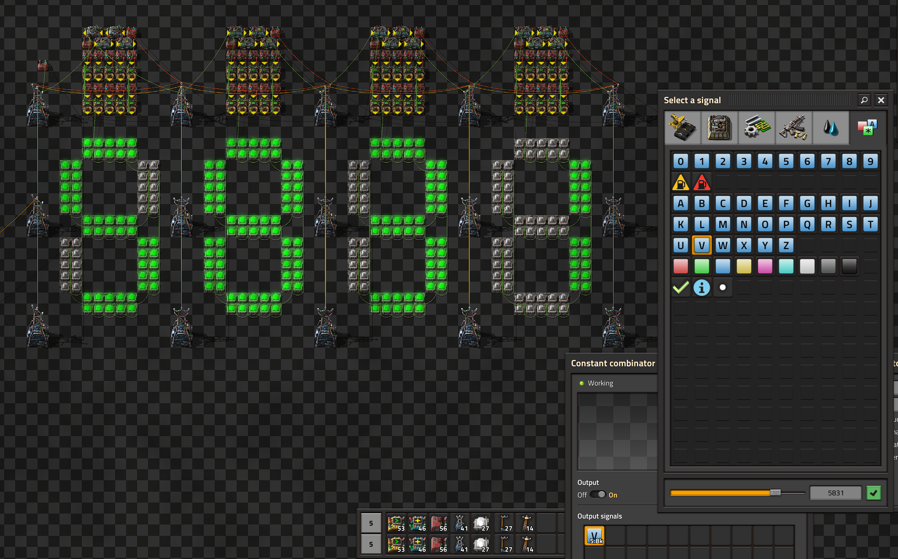

## Modular 7-Segment Display
Display can be scaled to any size and colors can be set on a per-digit basis.  
  

 

### Map view (requires mod [Lamps on Map](https://mods.factorio.com/mod/lampsonmap)):

  

### Blueprint strings:
- [First module](./first_module.txt)
- [Subsequent modules](./subsequent_modules.txt)

 

### Usage:

1. Place the first module and connect it to power.
2. Feed the value you want to display into the green wire of the substation in the top left corner **as the signal `V`**
  To remap a different signal to V, use an arithmetic combinator that adds 0 to the value and outputs it as V.
4. To change the color of the digit, edit the constant combinator wedged between the arithmetic combinators in the top left.
5. Use the blueprint string for subsequent modules to add more digits, making sure the left substations are pasted *over* the right substations of the previous module.

The display will automatically scale to the number of digits you added, as long as you are careful about pasting the modules (step 4).
