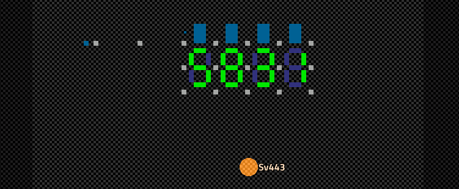
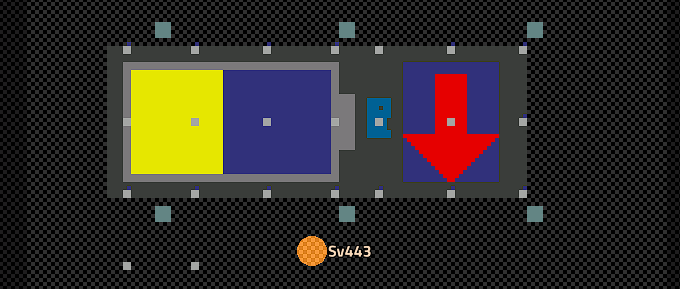
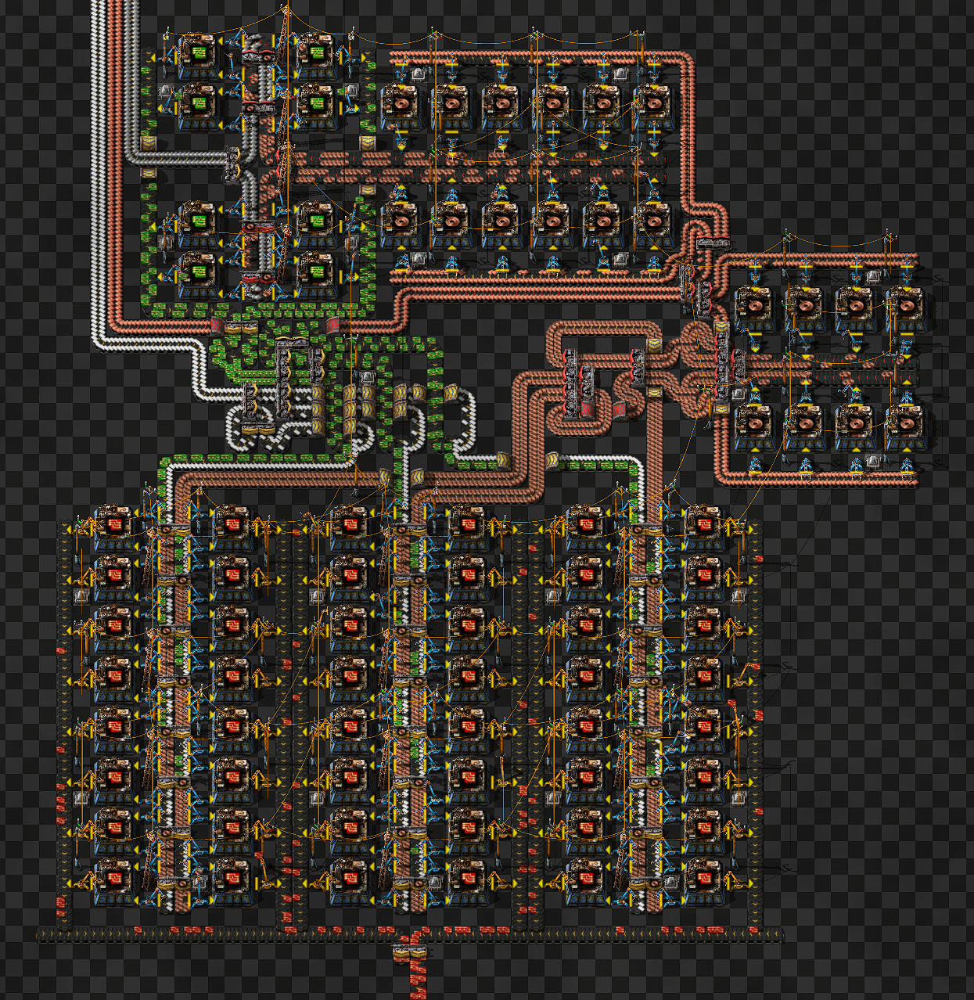

## FactorioBP
All my self-made Factorio blueprints.

 

### Displays:
- [Modular 7-Segment Display](./Displays/Modular-7-Segment-Display/)  
  Display can be scaled to any size and digit colors can be changed on a per-digit basis.  
  
- [Accumulator Level Display](./Displays/Accumulator-Level-Display/)  
  Display the charge level and power trend of all your accumulators with lamps.  
  

 

### Factories:
- [Red Circuit Factory](./Factories/Red-Circuits/)  
  This ratio-optimized and rather compact factory produces 360 advanced (red) circuits per minute.  
  
